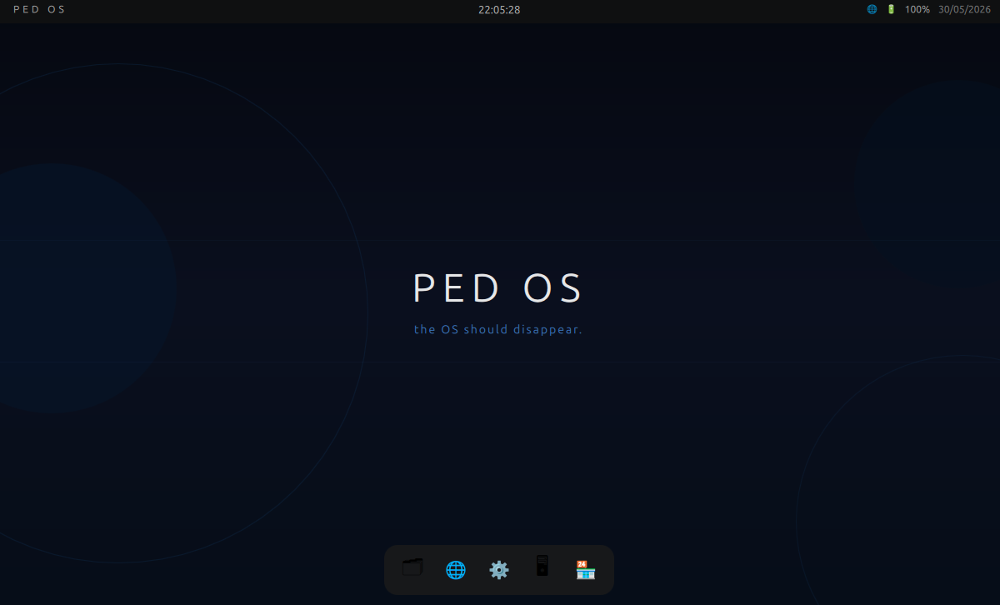
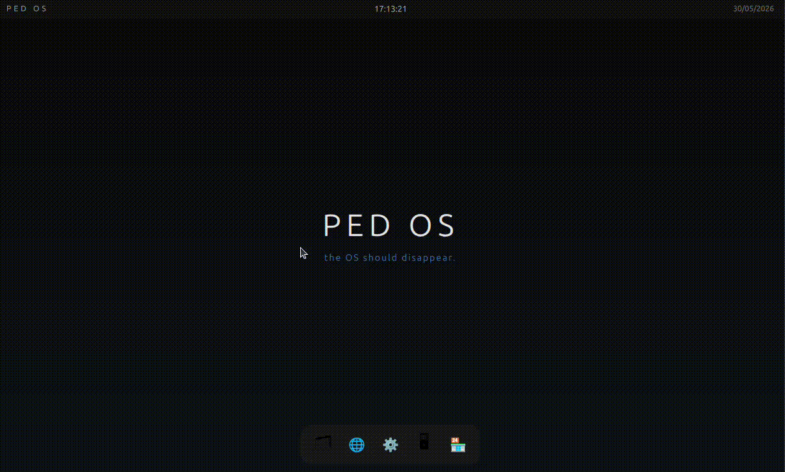
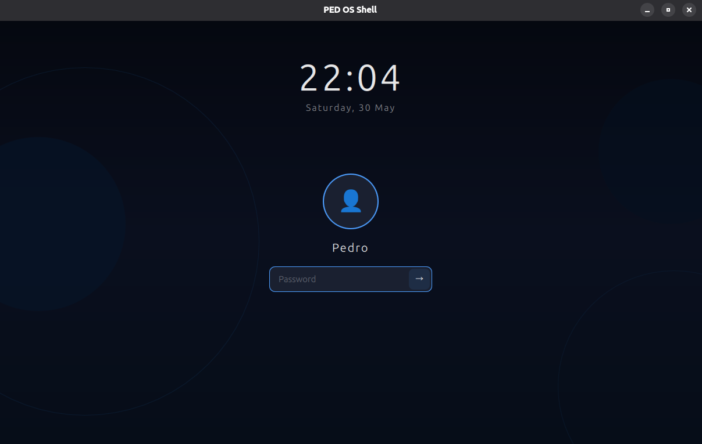
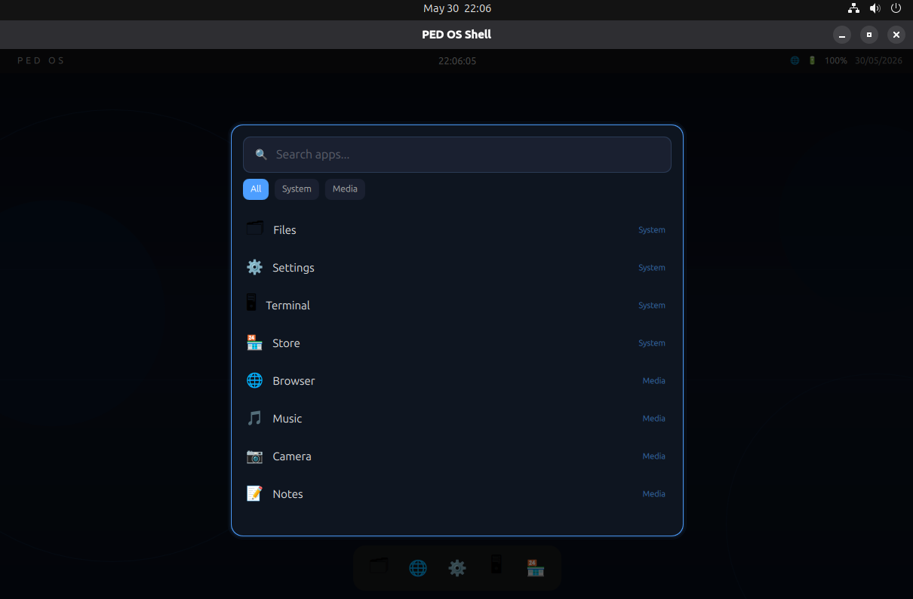
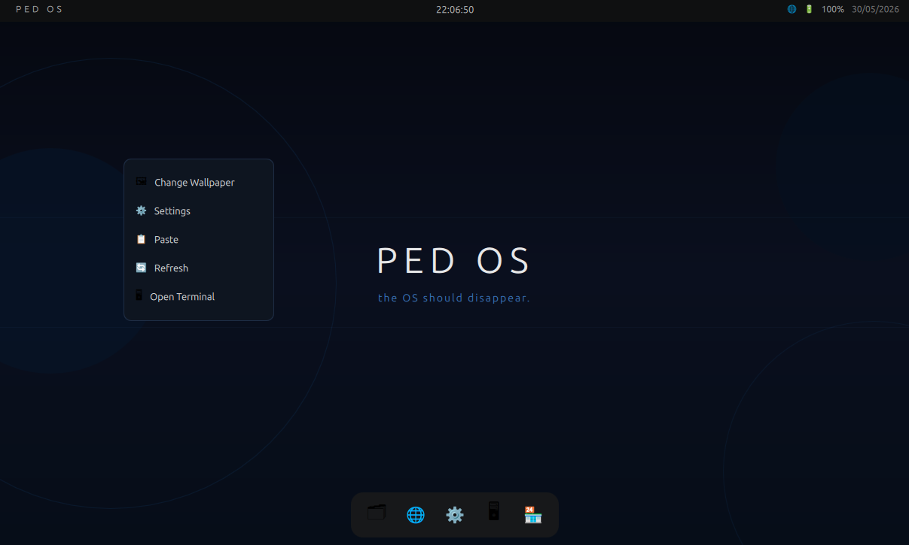

<div align="center">
  <h1>PED OS</h1>
  <p>A Linux-based operating system shell built for gamers. Fast, clean, and optimized for play.</p>

  
  
  
  
  

  <br/>

  

  <br/><br/>

  
</div>

---

## Philosophy

> "Gaming on Linux should be effortless. No tweaking. No struggling. Just play."

PED OS is built around one goal: make Linux gaming feel immediate, focused, and polished out of the box.

---

## Current State

PED OS Shell is currently running natively on **Arch Linux + Hyprland** on real hardware.

The current prototype manages:

- desktop wallpaper and top bar;
- login screen;
- system and gaming side docks;
- app launcher with search and install status;
- PED Files file manager MVP;
- right-click desktop context menu;
- notifications;
- PED Settings and Game Settings panels;
- first-run setup checklist;
- PT-BR / English interface language selection;
- CPU/GPU/RAM stats overlay;
- real app launch/focus/close through C++ and `hyprctl`.

The shell can auto-start from `hyprland.conf` through `exec-once`.

---

## Why PED OS?

- **Game-first workflow**: Steam, Lutris, Heroic and Bottles are first-class launcher targets.
- **Hyprland-native control**: window focus and close actions use `hyprctl` when available.
- **Real system data**: battery, network, CPU, GPU, RAM and temperature data come from C++ backends.
- **Gaming helpers**: Game Mode, MangoHud detection, Flatpak fallbacks and copied Steam launch options.
- **Clean interface**: side docks, launcher, settings panels, notifications and setup live in one shell.
- **Open source**: GPL-3.0 and community-driven.

---

## Features

| Feature | Status |
|---|---|
| Login screen with avatar, clock and password | Done |
| Geometric wallpaper with particles | Done |
| Top bar with clock, date, network, battery and Game Mode | Done |
| Game Mode toggle through C++ | Done |
| CPU/GPU/RAM stats overlay | Done |
| Missing GPU metrics shown as N/A | Done |
| System side dock | Done |
| Gaming side dock | Done |
| Dock hover, tooltip, bounce and active indicator | Done |
| Dock open, minimized and closed app states | Done |
| Real app launch through C++ | Done |
| Focus running apps before opening duplicates | Done |
| Close apps through `hyprctl` / process fallback | Done |
| Dock right-click action menu | Done |
| Launcher with search and categories | Done |
| Gaming category with Steam, Lutris, Heroic and Bottles | Done |
| Installed/not installed detection for gaming apps | Done |
| Flatpak fallback for gaming apps | Done |
| MangoHud/GameMode launch path for gaming apps | Done |
| PED Settings panel | Done |
| Game Settings panel | Done |
| First Setup panel | Done |
| PED Files file manager MVP | Done |
| PT-BR / English language selection in Settings | Done |
| Persistent user settings through `QSettings` | Done |
| Notification system | Done |
| Desktop context menu | Done |
| Auto-start through Hyprland config | Done |
| GPU driver manager | Planned |
| Per-game performance profiles | Planned |
| Bootable ISO | Planned |

---

## Screenshots

<div align="center">

### Login Screen


### Desktop


### Launcher


### Context Menu


</div>

---

## Stack

| Layer | Technology |
|---|---|
| Kernel | Linux |
| Display Server | Wayland |
| Compositor | Hyprland |
| Rendering | Vulkan / OpenGL |
| Core | C++ / Qt |
| Interface | Qt6 / QML |
| Build System | CMake 3.20+ |
| Settings Storage | QSettings |
| Font | Exo 2 |

---

## Repository Layout

| Path | Description |
|---|---|
| `packages/ped-shell` | Main Qt/QML desktop shell |
| `packages/ped-shell/src` | C++ system integration backends |
| `packages/ped-shell/include` | C++ headers exposed to Qt/QML |
| `packages/ped-shell/qml` | Shell UI, docks, launcher, settings and overlays |
| `docs` | Architecture, build guide, roadmap and contribution docs |
| `assets` | Screenshots and demo media |
| `scripts` | Project helper scripts |

---

## ped-shell Components

| Component | File(s) | Description |
|---|---|---|
| Desktop shell | `qml/Main.qml` | Top bar, wallpaper, docks, panels and app orchestration |
| Launcher | `qml/Launcher.qml` | App search, categories and gaming app status |
| Login screen | `qml/LoginScreen.qml` | Startup login flow |
| Notifications | `qml/NotificationCenter.qml` | Toast notifications |
| Desktop menu | `qml/ContextMenu.qml` | Right-click desktop actions |
| Stats overlay | `qml/FpsOverlay.qml`, `systemstats.cpp` | CPU, GPU, RAM and temperature overlay |
| PED Settings | `qml/SettingsPanel.qml`, `usersettings.cpp` | Appearance and shell preferences |
| Game Settings | `qml/GameSettingsPanel.qml` | MangoHud, GameMode and gaming launchers |
| First Setup | `qml/FirstSetupPanel.qml` | First-run checklist and install commands |
| PED Files | `qml/FilesPanel.qml`, `filemanager.cpp` | Local file navigation, open, create folder, rename and trash |
| System info | `systeminfo.cpp` | Battery and network data |
| App launcher | `applauncher.cpp` | Launch, focus, close, Flatpak and MangoHud helpers |
| Game Mode | `gamemode.cpp` | Game Mode state and integration |
| Localization | `qml/Main.qml`, `usersettings.cpp` | English/PT-BR text mapping and persisted language preference |

---

## Build

See [docs/building.md](docs/building.md).

Quick Arch setup:

```bash
sudo pacman -S git cmake qt6-base qt6-declarative base-devel wget noto-fonts-emoji gamemode lib32-gamemode mangohud lib32-mangohud flatpak vulkan-tools
```

Build:

```bash
cd packages/ped-shell
cmake -B build
cmake --build build
./build/ped-shell
```

Default login password: `1234` or blank.

---

## Roadmap

See [docs/roadmap.md](docs/roadmap.md).

Current near-term focus:

- refine GPU stats on more hardware;
- validate MangoHud with real games;
- improve PED Settings and localization coverage;
- continue evolving PED Files into a richer file manager;
- prepare Arch packaging;
- start the bootable ISO path with `archiso`.

---

## Contributing

See [docs/contributing.md](docs/contributing.md).

---

<div align="center">
  <sub>Built for gamers. Powered by Linux.</sub>
</div>
