<div align="center">
  

  <p>A gaming-first Linux shell built around speed, focus, and a polished desktop experience.</p>

  
  
  
  
  
  

  <p><a href="https://unexus-os.vercel.app">Project website</a></p>

</div>

---

## Preview

<div align="center">
  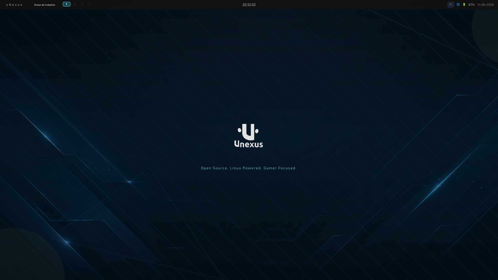
  <br>
  <sub>uNexus desktop with the default visual identity.</sub>
</div>

<br>

<table>
  <tr>
    <td width="50%">
      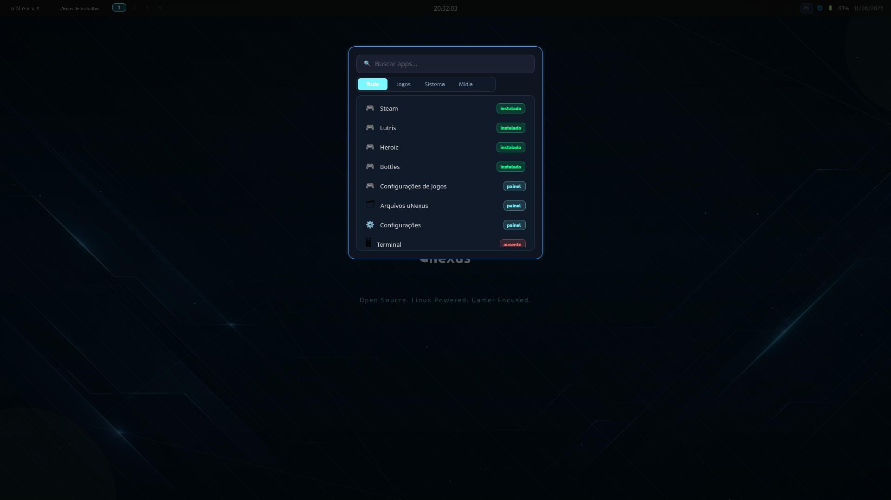
      <br>
      <sub><b>Launcher</b> with categories, search and app state chips.</sub>
    </td>
    <td width="50%">
      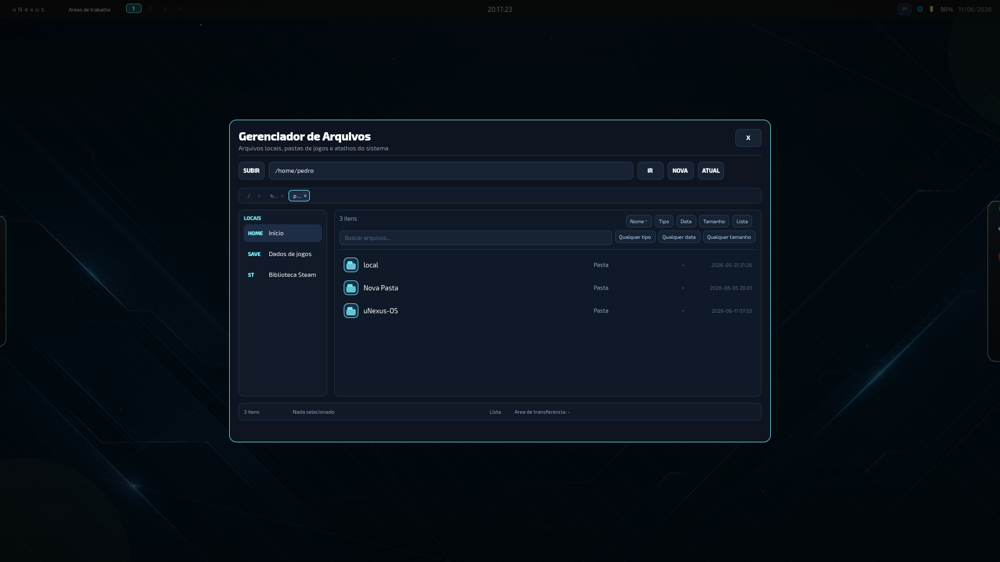
      <br>
      <sub><b>uNexus Files</b> with places, breadcrumbs, sorting and file actions.</sub>
    </td>
  </tr>
  <tr>
    <td width="50%">
      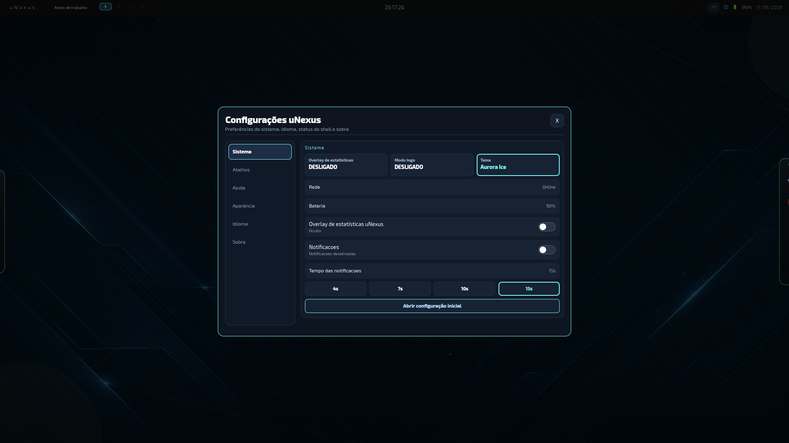
      <br>
      <sub><b>Settings</b> for system, appearance, language and shortcuts.</sub>
    </td>
    <td width="50%">
      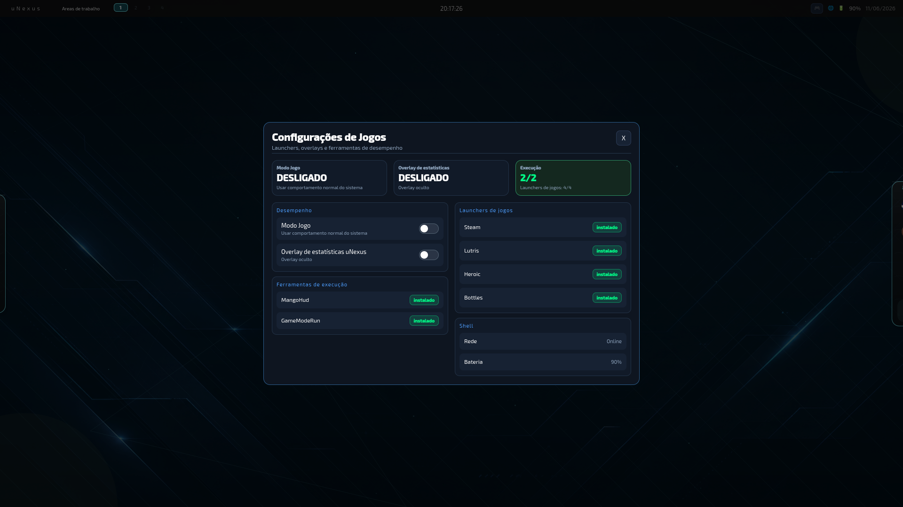
      <br>
      <sub><b>Game Settings</b> for launchers, GameMode and overlay tooling.</sub>
    </td>
  </tr>
  <tr>
    <td width="50%">
      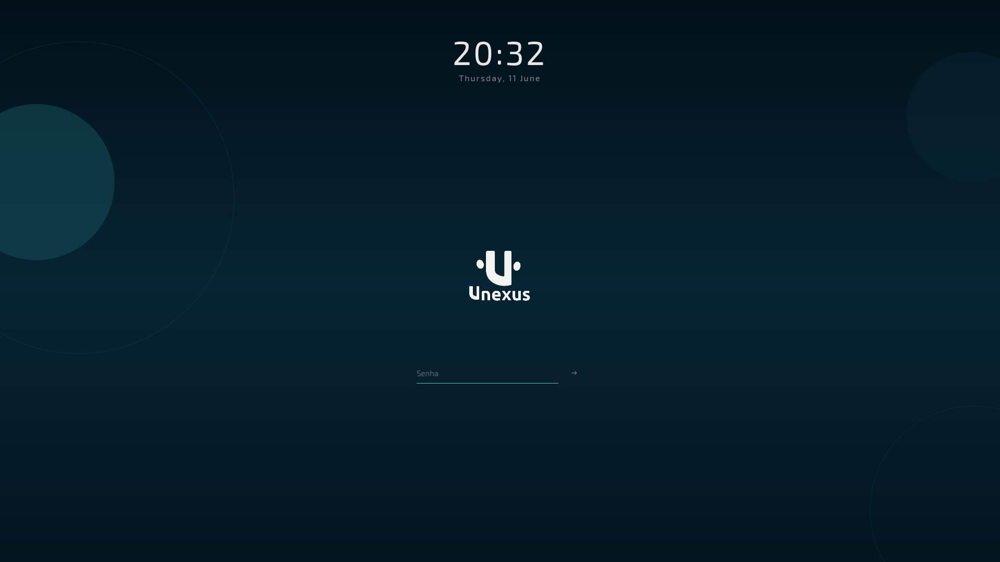
      <br>
      <sub><b>Login</b> with the same polished visual language as the desktop.</sub>
    </td>
    <td width="50%">
      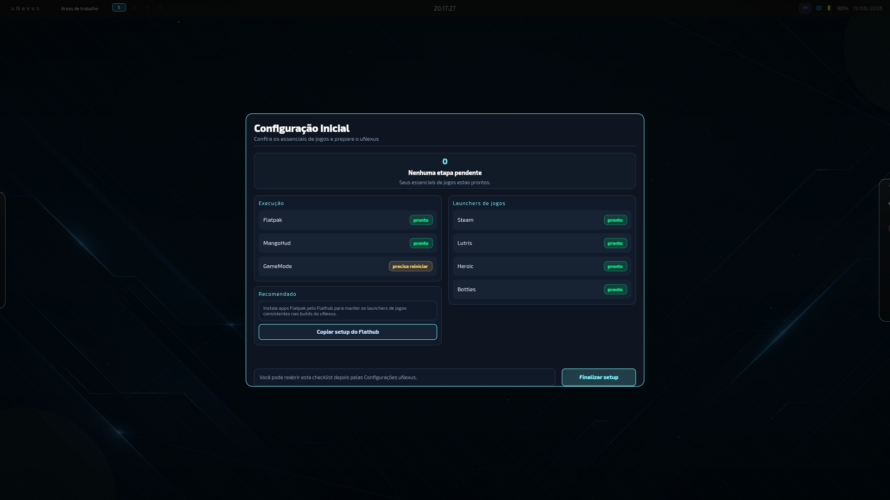
      <br>
      <sub><b>First Setup</b> for initial system and gaming readiness checks.</sub>
    </td>
  </tr>
  <tr>
    <td width="50%">
      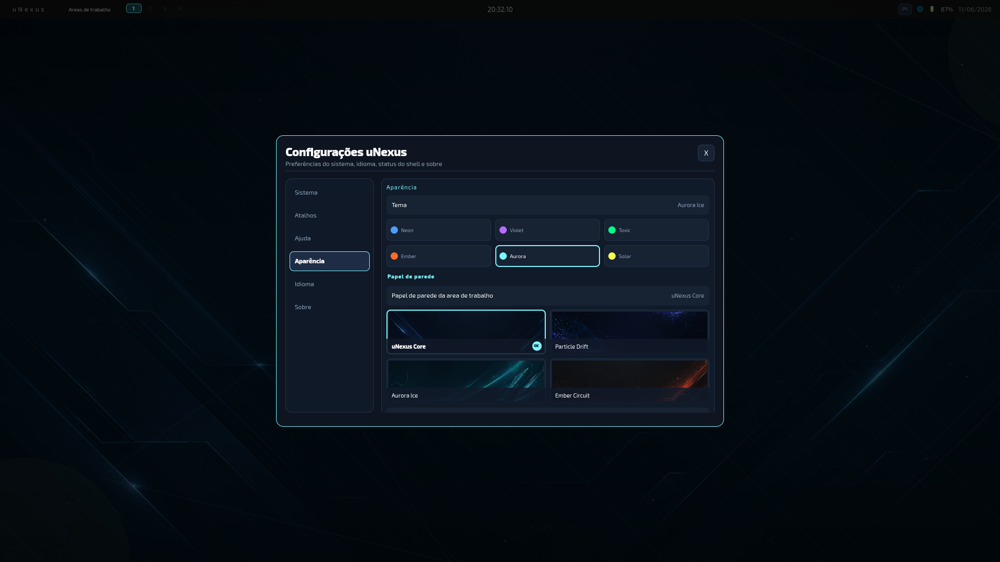
      <br>
      <sub><b>Appearance</b> with theme and wallpaper customization.</sub>
    </td>
    <td width="50%">
      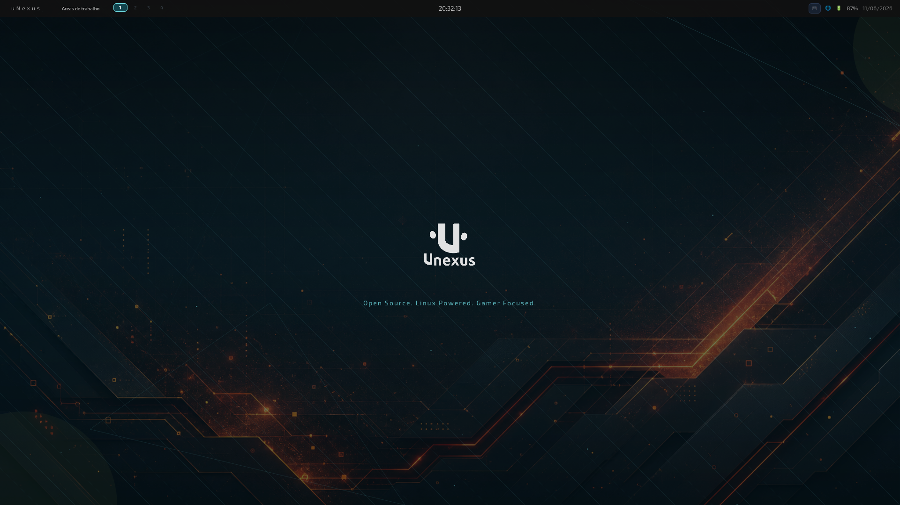
      <br>
      <sub><b>Wallpapers</b> with alternate desktop styles.</sub>
    </td>
  </tr>
  <tr>
    <td width="50%">
      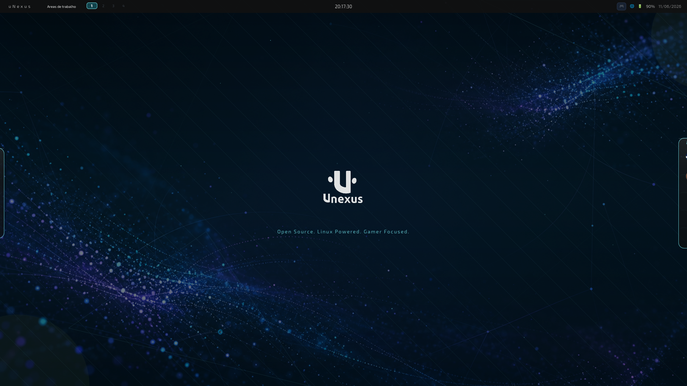
      <br>
      <sub><b>Particle Drift</b> wallpaper.</sub>
    </td>
    <td width="50%">
      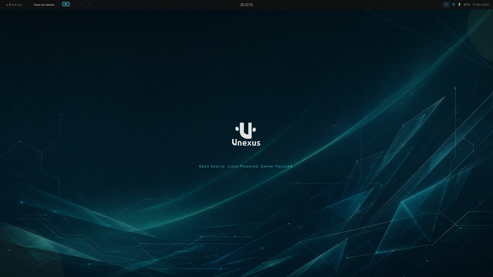
      <br>
      <sub><b>Aurora Ice</b> wallpaper.</sub>
    </td>
  </tr>
</table>

---

## Philosophy

> "Open Source. Linux Powered. Gamer Focused."

uNexus is built around one goal: make Linux gaming feel immediate, focused, and polished out of the box.

---

## Current State

uNexus Shell is currently running natively on **Arch Linux + Hyprland** on real hardware.

The repository currently contains a working shell, native installer prototype, Arch packaging, ISO profile and validation tooling. It is still an early tester operating system foundation, not a production-ready daily-driver distribution.

The current implementation includes:

- branded desktop wallpaper set, animated background layer and top bar;
- bootable `archiso` live image profiles under `ISO/0.0.1`, `ISO/0.0.2` and `ISO/0.0.3`, with 0.0.3 as the current validation target;
- fullscreen login screen;
- system and gaming side docks with real icon lookup and drawn fallbacks;
- app launcher with search, categories and installed/running/missing status chips;
- uNexus Files with navigation, breadcrumbs, sorting, multi-select, clipboard actions, keyboard shortcuts and previews;
- privacy-first uNexus AI assistant MVP that runs against a local model through loopback-only `llama-server`, with opt-in JSON history and First Setup engine controls;
- internal uNexus CMD panel for shell commands without relying on external terminal apps;
- right-click desktop and file-manager context menus;
- actionable notifications with queue controls, persistent notification preferences and stats overlay;
- uNexus Settings control center with system, hardware, appearance, language, shortcuts, help and about sections;
- Game Settings dashboard with GameMode, MangoHud and real Flatpak launcher install actions;
- first-run setup checklist;
- PT-BR / English interface language selection;
- real app launch, focus, close, maximize, move and minimize/restore through C++ and `hyprctl`;
- Windows-like global shortcuts for Launcher, Settings, Game Settings and stats overlay;
- workspace indicators and compositor-ready window preview direction;
- installable Hyprland session, recovery session and automatic TUI recovery menu after shell crashes;
- `unexusctl` for doctor, logs, backup, rollback, driver switching, update and state management;
- graphical Qt/QML installer wizard for local install, repair, diagnostics, removal and system provisioning flows;
- native guarded disk installer backend for UEFI/systemd-boot installs through `scripts/install-os.sh`;
- Settings > About update channel selection and a `Super+B` bug report generator for logs/specs/version capture.

The shell can be installed as a Wayland session through `scripts/setup.sh`.
The current live ISO profile can be built with `ISO/0.0.3/build-iso.sh`.

---

## Latest Release

The latest public release is [v0.0.3](https://github.com/PedroVitor-Dev/uNexus-OS/releases/tag/v0.0.3), released on **June 25, 2026**.

This build is **not recommended for daily use yet**. It is an early tester release for the uNexus shell, live image foundation, graphical installer path and recovery workflows while packaging, destructive VM installs and hardware validation continue to mature.

Because uNexus targets the real Hyprland/uNexus session stack, test it on spare hardware or a disposable VM, not as a daily driver.

### What's New In 0.0.3

- Local-only `uNexus AI` assistant MVP with loopback `llama-server`, streaming chat, opt-in JSON history and First Setup engine controls.
- Internal `uNexus CMD` panel for command execution without depending on an external terminal app.
- GPU Driver Manager and Driver Wizard integration for NVIDIA/AMD/Intel detection, NVIDIA install guidance, Secure Boot warnings and rollback-aware driver switching.
- Minimal native Qt/QML disk installer flow with disk selection, first-user configuration, plan preview and install progress through `pkexec`.
- First Setup now covers readiness checks, GPU driver guidance, local AI model controls and gaming launchers.
- uNexus Files polish: sidebar, grid/list views, status bar, rubber-band selection, previews, real file actions and better keyboard shortcuts.
- Actionable notifications with Open, Dismiss, Silence for 1h, visible queue controls and configurable timeout.
- Startup loading screen, Plymouth splash, recovery shell improvements and stronger session packaging.
- Public docs refreshed for architecture, building, AI privacy, GPU drivers, installer state, ISO testing and release validation.
- Screenshot/video capture now forces English UI text for public project assets.

---

## Why uNexus?

- **Game-first workflow**: Steam, Lutris, Heroic and Bottles are first-class launcher targets.
- **Hyprland-native control**: window focus, close, maximize, move and minimize/restore actions use `hyprctl` when available.
- **Real system data**: battery, network, CPU, GPU, RAM and temperature data come from C++ backends.
- **Gaming helpers**: Game Mode, MangoHud detection, Steam launch-option helpers and real Flatpak launcher installs.
- **Clean interface**: side docks, launcher, settings panels, notifications and setup live in one cohesive token-driven shell.
- **uNexus visual language**: shared design tokens, Liquid Glass surfaces, spring motion and official wallpapers give the shell a recognizable feel.
- **Open source**: GPL-3.0 and community-driven.

---

## Feature Status

Recent shipping focus:

| Area | Status |
|---|---|
| Official wallpaper identity set | Added `unexus-core`, `particle-drift`, `aurora-ice` and `ember-circuit` assets |
| Wayland session packaging | Installable `uNexus` and `uNexus Recovery` sessions are in place |
| Global shortcuts | Windows-style Launcher, Settings, Game Settings and stats shortcuts are implemented |
| Settings shortcuts/help | Shortcut customization, apply buttons, restore defaults and help panel are available |
| Game launcher installs | Game Settings starts real Flatpak installs for Steam, Lutris, Heroic and Bottles |
| uNexus Files polish | Context menu, copy/cut/paste hotkeys, sorting, previews and layout fixes are in place |
| uNexus AI | Local-only assistant MVP exists with streaming chat, opt-in JSON history and First Setup engine controls; model manager and sandboxed runtime are planned |
| uNexus CMD | Internal command panel is available from the dock and desktop context menu |
| GPU Driver Manager | Hardware section, First Setup panel and rollback-aware Driver Wizard are implemented; real hardware validation is still pending |
| Graphical installer | Native Qt/QML disk-install flow exists with disk selection, user configuration and progress; partition review and dual-boot safety are still pending |
| Notifications | Actionable queue, Open/Dismiss/Silence controls and configurable timeout are implemented |
| Visual language | Tokens now cover spacing, radius, typography, surfaces and motion |
| Bootable ISO 0.0.3 | Archiso live profile with Hyprland, uNexus Shell, autologin, recovery modes, native disk installer backend and USB writer |
| Session authentication | The normal session starts the KDE Polkit agent when available for graphical privilege prompts |
| Visual defaults | ISO/session now include icon themes, Qt SVG support, fonts, MIME metadata and Qt/GTK style defaults |

For the full staged roadmap, see [docs/roadmap.md](docs/roadmap.md).
For the current installation milestone audit, see [docs/milestone-status.md](docs/milestone-status.md).
For the shell-to-distro implementation checklist, see [docs/distro-implementation-status.md](docs/distro-implementation-status.md).

### Validation Status

| Area | State |
|---|---|
| Local source audit | README, docs, package files, shell components and ISO 0.0.3 profile are present in the repository |
| Arch package path | Implemented through `packaging/arch/PKGBUILD` and `scripts/package-arch.sh`; clean fresh-VM package run still needs to be recorded |
| ISO build path | Implemented through `ISO/0.0.3/build-iso.sh`; current successful build result should be recorded from an Arch host |
| QEMU smoke testing | `scripts/test-iso-vm.sh` and `scripts/validate-iso-release.sh` exist; checked-in run is still blocked on the previous Windows environment |
| Destructive install test | Installer backend exists; full install/reboot VM evidence is still pending |
| Real hardware testing | Real hardware validation reports for AMD/Intel and NVIDIA are still pending |

### Known Limitations

- uNexus OS is not recommended as a daily driver yet.
- The current native disk installer targets whole-disk UEFI/systemd-boot installs; partition review, dual-boot safety and GRUB support are still planned.
- GPU driver switching is implemented at the shell/tooling level, but NVIDIA hardware validation and Secure Boot edge cases still need real-machine testing.
- uNexus AI is local-only by design, but it depends on a local `llama-server` runtime and a user-provided `.gguf` model.
- Screenshot capture is prepared to force English UI text, but public assets should be regenerated from an Arch/Hyprland environment before every major release.

---

## Stack

| Layer | Technology |
|---|---|
| Kernel | Linux |
| Display Server | Wayland |
| Compositor | Hyprland |
| Rendering | Vulkan / OpenGL |
| Core | C++20 / Qt 6 |
| Interface | Qt Quick / QML |
| Build System | CMake 3.20+ |
| Package Target | Arch Linux package and Archiso live image |
| Settings Storage | QSettings |
| Privileged Actions | Polkit / `pkexec` |
| AI Runtime | Local loopback `llama-server` with GGUF models |
| Font | Exo 2 |

---

## Repository Layout

| Path | Description |
|---|---|
| `packages/unexus-shell` | Main Qt/QML desktop shell |
| `packages/unexus-installer` | Native Qt/QML installer prototype |
| `packages/unexus-dock`, `packages/unexus-files`, `packages/unexus-launcher`, `packages/unexus-settings`, `packages/unexus-store` | Reserved package directories for future component split |
| `packages/unexus-shell/src` | C++ system integration backends |
| `packages/unexus-shell/include` | C++ headers exposed to Qt/QML |
| `packages/unexus-shell/qml` | Shell UI, design tokens, docks, launcher, settings and overlays |
| `packaging/linux` | Desktop entries, Wayland sessions and session launchers |
| `packaging/arch` | Arch Linux PKGBUILD |
| `ISO/0.0.1` | First bootable Archiso live image profile retained for historical 0.0.1 work |
| `ISO/0.0.2` | Previous Archiso milestone retained for historical 0.0.2 work |
| `ISO/0.0.3` | Current Archiso live image profile, release checks, VM smoke tests and USB writer |
| `docs` | Architecture, build guide, roadmap and contribution docs |
| `docs/test-results` | Recorded VM/release validation runs |
| `assets` | Logo, wallpaper and media assets |
| `scripts` | Build, install, package, uninstall, doctor and control scripts |

---

## Installer Direction

uNexus targets a graphical, double-click installer experience.

- `uNexus Installer` exists as a Qt/QML visual installer for local install, repair, diagnostics and removal.
- Arch packages and `pacman` remain the native backend.
- Flatpak can power friendly user-app installs.
- `scripts/setup.sh` remains the development/local repair installer.
- `unexus-installer` now exposes a minimal graphical disk-install flow that previews and executes `scripts/install-os.sh`.
- `scripts/install-os.sh` remains the guarded native disk installer backend for UEFI/systemd-boot installs.
- `ISO/0.0.3` is the current `archiso` live image foundation.
- Calamares is not integrated yet; the current disk-install path is the uNexus Qt/QML installer calling the native script backend.

See [docs/installer-technology.md](docs/installer-technology.md).

---

## unexus-shell Components

| Component | File(s) | Description |
|---|---|---|
| Desktop shell | `qml/Main.qml` | Top bar, wallpaper, docks, panels and app orchestration |
| Design tokens | `qml/DesignTokens.qml` | Shared spacing, radius, motion, type, surface, text and status values |
| Liquid Glass material | `qml/LiquidGlass.qml` | Shared translucent depth material for docks, menus and notifications |
| Launcher | `qml/Launcher.qml` | App search, categories and gaming app status |
| Login screen | `qml/LoginScreen.qml` | Startup login flow |
| Notifications | `qml/NotificationCenter.qml` | Toast notifications |
| Desktop menu | `qml/ContextMenu.qml` | Right-click desktop actions |
| Stats overlay | `qml/FpsOverlay.qml`, `systemstats.cpp` | CPU, GPU, RAM and temperature overlay |
| uNexus Settings | `qml/SettingsPanel.qml`, `usersettings.cpp` | Control center sections, appearance, shortcuts, language and shell preferences |
| Game Settings | `qml/GameSettingsPanel.qml` | Dashboard, MangoHud, GameMode and gaming launcher installs |
| First Setup | `qml/FirstSetupPanel.qml` | First-run checklist and dependency guidance |
| uNexus Files | `qml/FilesPanel.qml`, `filemanager.cpp` | Local file navigation, multi-select, copy/cut/paste, open, create folder, rename, previews and trash |
| uNexus CMD | `qml/TerminalPanel.qml`, `commandrunner.cpp` | Internal shell command panel with output, history, `cd`, `clear` and stop control |
| uNexus AI | `qml/AIAssistantPanel.qml`, `qml/AIChatBubble.qml`, `aiassistant.cpp`, `aiengine.cpp` | Local-only assistant UI, llama-server lifecycle, streaming chat, optional JSON history and First Setup controls |
| GPU Driver Manager | `qml/GpuDriverPanel.qml`, `gpudrivermanager.cpp` | GPU vendor/driver detection, recommended-driver mapping, NVIDIA guidance, Secure Boot warnings and rollback-aware switching |
| Global shortcuts | `globalshortcuts.cpp`, `main.cpp` | Hyprland-triggered shortcut command bridge |
| Session control | `packaging/linux/unexus-session`, `unexus-recovery-session`, `unexus-recovery-menu` | Normal session, recovery session and automatic TUI crash fallback |
| Installer | `packages/unexus-installer` | Graphical Qt/QML installer wizard backed by setup, doctor and uninstall scripts |
| CLI control | `scripts/unexusctl.sh`, `scripts/unexus-doctor.sh` | State management, diagnostics, update, rollback and logs |
| System info | `systeminfo.cpp` | Battery and network data |
| App launcher | `applauncher.cpp` | Launch, focus, close, Flatpak and MangoHud helpers |
| Game Mode | `gamemode.cpp` | Game Mode state and integration |
| Localization | `qml/Main.qml`, `usersettings.cpp` | English/PT-BR text mapping and persisted language preference |

---

## Build

See [docs/building.md](docs/building.md).

### Development Install

```bash
cd ~/uNexus-OS
git pull
sudo sh scripts/setup.sh
unexusctl doctor
```

### Manual Shell Build

```bash
cd packages/unexus-shell
cmake -B build
cmake --build build
./build/unexus-shell
```

Default login password: `1234` or blank.

### Arch Package

```bash
cd ~/uNexus-OS
sh scripts/package-arch.sh
```

The generated package and local repository are written under `dist/arch/`.

### ISO Build

```bash
cd ~/uNexus-OS
sudo sh ISO/0.0.3/build-iso.sh
```

Write the generated ISO to a USB disk:

```bash
sudo sh ISO/0.0.3/write-usb.sh /dev/sdX
```

Replace `/dev/sdX` with the whole USB disk, not a partition.

The live image is expected to boot with the uNexus visual baseline already present: Papirus/Breeze/Adwaita/hicolor icons, Qt SVG/imageformat plugins, Noto/DejaVu/Liberation fallback fonts, GTK dark defaults, Adwaita cursor settings and the First Setup checklist on first login.

### Release Validation

```bash
sh scripts/validate-iso-release.sh --build
```

Run the VM smoke test after building the ISO:

```bash
sh scripts/test-iso-vm.sh
```

On an Arch test host, install the VM dependencies first:

```bash
sudo pacman -S qemu-full edk2-ovmf
```

Record successful release runs under `docs/test-results/YYYYMMDD-qemu.md`.

### Public Assets

Regenerate README screenshots and preview videos in English:

```bash
sh scripts/capture-assets.sh
```

This builds `unexus-shell` and runs `unexus-shell --capture-assets assets`. Capture mode forces English UI text so the public screenshots stay consistent regardless of the saved local language.

### Local AI Model

Prepare an optional local AI model:

```bash
setup-ai-model.sh --local /path/to/model.gguf
```

Curated model downloads intentionally refuse to run until their SHA-256 hashes are pinned in `scripts/setup-ai-model.sh`. First Setup can refresh installed `.gguf` models and start or stop the local AI engine.

---

## Roadmap

See [docs/roadmap.md](docs/roadmap.md).

Current near-term focus:

- record clean Arch package, ISO build and QEMU BIOS/UEFI validation results for 0.0.3;
- run a destructive install/reboot test in a disposable VM;
- validate GPU Driver Manager behavior on AMD/Intel and NVIDIA hardware;
- harden the native installer with partition review, dual-boot safety and clearer rollback paths;
- continue the Game Library and per-game profile data model.

---

## Documentation Map

| Document | Purpose |
|---|---|
| [docs/architecture.md](docs/architecture.md) | Shell architecture, runtime model and subsystem boundaries |
| [docs/building.md](docs/building.md) | Build, package, ISO and validation instructions |
| [docs/roadmap.md](docs/roadmap.md) | Staged product roadmap |
| [docs/milestone-status.md](docs/milestone-status.md) | Installation milestone audit |
| [docs/distro-implementation-status.md](docs/distro-implementation-status.md) | Shell-to-distro implementation checklist |
| [docs/installer-technology.md](docs/installer-technology.md) | Native installer direction and tradeoffs |
| [docs/gpu-driver-manager.md](docs/gpu-driver-manager.md) | GPU detection, driver recommendation and rollback flow |
| [docs/ai-assistant.md](docs/ai-assistant.md) | Local AI assistant privacy model and setup |
| [docs/design-tokens.md](docs/design-tokens.md) | Design token system |
| [docs/liquid-glass.md](docs/liquid-glass.md) | Liquid Glass visual material |
| [docs/contributing.md](docs/contributing.md) | Contribution guide |

---

## Contributing

See [docs/contributing.md](docs/contributing.md).

---

<div align="center">
  <sub>Open Source. Linux Powered. Gamer Focused.</sub>
</div>
